# Sync Strategy Documentation

## Overview

This sync engine implements a **CRM-priority, one-way sync** strategy after an initial import from Finance.

## Sync Flow

```mermaid
graph TD
    A[Initial Setup] --> B[Import Finance → CRM]
    B --> C[Create Entity Mappings]
    C --> D[Normal Operations]
    
    D --> E{Change Detected}
    E -->|CRM Change| F[CRM → Finance]
    E -->|Finance Change| G[Skip - CRM Priority]
    
    F --> H[Check Duplicate by Customer Number]
    H -->|Exists| I[Update Finance]
    H -->|New| J[Create in Finance]
    
    I --> K[Update Mapping]
    J --> K
    K --> L[Log Success]
```



## Three Phases

### Phase 1: Initial Import (One-Time)

**Direction:** Finance (Siagh) → CRM  
**When:** First time setup only  
**Purpose:** Import existing customers from Finance to CRM

**Process:**
1. Fetch all customers from Finance (Siagh)
2. For each customer:
   - Check if customer number already exists in CRM
   - Skip if duplicate found
   - Create in CRM if new
   - Create entity mapping (Finance ID ↔ CRM ID)

**Command:**
```bash
npm run initial-import
```

**Key Points:**
- Uses customer number as unique key
- Prevents duplicates
- Creates mappings for future syncs
- Only run once

### Phase 2: CRM → Finance (Ongoing)

**Direction:** CRM → Finance  
**When:** Continuous (webhooks + polling)  
**Purpose:** Keep Finance updated with CRM changes

**Process:**
1. Detect change in CRM (webhook or poll)
2. Check for loop (did we cause this change?)
3. Fetch customer from CRM
4. Check if exists in Finance:
   - **If mapped:** Update Finance customer
   - **If has customer number:** Find by number, link if exists
   - **If new:** Create in Finance
5. Update entity mapping
6. Log operation

**Triggers:**
- CRM webhooks (real-time)
- Polling CRM every 5 minutes
- Manual sync

**Key Points:**
- CRM is source of truth
- Finance is always updated to match CRM
- Customer number prevents duplicates
- Idempotent operations

### Phase 3: Invoices (CRM → Finance)

**Direction:** CRM → Finance only  
**When:** Invoice created/updated in CRM  
**Purpose:** Create corresponding PreInvoice in Siagh

**Process:**
1. Detect invoice in CRM
2. Get linked customer mapping
3. Transform to Siagh PreInvoice format
4. Create in Finance with proper item structure
5. Log operation

**Key Points:**
- Invoices flow only from CRM to Finance
- Customer must exist in both systems
- Complex dataRows structure for Siagh

## Conflict Resolution

**Strategy:** **CRM Always Wins**

| Scenario | Action |
|----------|--------|
| CRM updated, Finance not | Sync CRM → Finance |
| CRM updated, Finance also updated | CRM wins, update Finance |
| Finance updated, CRM not | **Skip** (CRM priority) |
| Both updated simultaneously | CRM wins, update Finance |

**Rationale:**
- CRM is the operational system
- Sales team works in CRM
- Finance is reporting/accounting
- Finance follows CRM, not the other way

## Duplicate Prevention

### Customer Number as Unique Key

- **Primary Key:** Customer number/code from CRM
- **Check Before Create:** Query Finance by customer number
- **Link if Exists:** If found, create mapping instead of new customer
- **Create if New:** Only create if truly doesn't exist

### Entity Mapping Table

```sql
EntityMapping {
  id: UUID
  entityType: CUSTOMER | PREINVOICE
  crmId: CRM customer ID
  financeId: Finance customer code (number)
  lastSyncTransactionId: UUID (loop prevention)
  crmChecksum: Hash of CRM data
  financeChecksum: Hash of Finance data
  crmUpdatedAt: CRM timestamp
  financeUpdatedAt: Finance timestamp
}
```

**Purposes:**
1. Link entities between systems
2. Detect changes via checksum
3. Prevent loops via transaction ID
4. Track sync history

## Loop Prevention

### Three-Layer Protection

1. **Transaction ID Check**
   - Each sync generates unique UUID
   - Stored in mapping after sync
   - If incoming change has our transaction ID → Skip

2. **Checksum Comparison**
   - Hash of entity data
   - Compare before syncing
   - If checksums match → No changes, skip

3. **Time-Based Gating**
   - If synced within last 10 seconds → Skip
   - Prevents rapid back-and-forth

### Example Scenario

```
1. User updates customer in CRM
   └─> CRM webhook fires

2. Sync engine processes:
   ├─> Transaction ID: abc-123
   ├─> Fetch from CRM
   ├─> Update Finance
   └─> Store transaction ID in mapping

3. Finance system MAY trigger change event
   └─> But we check transaction ID
       └─> Matches abc-123 → SKIP (loop detected)

4. No infinite loop! ✅
```

## Webhook vs Polling

### Webhooks (Preferred)

**When:** CRM supports webhooks  
**Advantages:**
- Real-time sync
- Lower resource usage
- Immediate updates

**Setup:**
```bash
# Enable in .env
ENABLE_WEBHOOKS=true

# Register webhook with CRM
POST https://crm.payamgostar.com/api/webhooks
{
  "url": "https://your-domain.com/webhook/crm",
  "events": ["customer.created", "customer.updated"]
}
```

### Polling (Fallback)

**When:** Webhooks not available  
**Frequency:** Every 5 minutes (configurable)  
**Advantages:**
- Works without webhook support
- Reliable fallback

**How it works:**
```
Every 5 minutes:
  1. Query CRM for customers updated since last poll
  2. For each updated customer:
     └─> Queue sync job
  3. Process queue asynchronously
```

## Data Flow Diagrams

### Initial Import Flow

```
Finance (Siagh)                 Sync Engine                    CRM (Payamgostar)
      │                              │                                │
      │◄─────── Get All Contacts ────│                                │
      │                              │                                │
      │────── Return Contacts ──────►│                                │
      │                              │                                │
      │                              │───► Check Duplicate (by code) ─►│
      │                              │                                │
      │                              │◄──── Existing Customers ───────│
      │                              │                                │
      │                              ├─ Filter New Customers          │
      │                              │                                │
      │                              │────── Create Customer ─────────►│
      │                              │                                │
      │                              │◄────── CRM Customer ID ────────│
      │                              │                                │
      │                              ├─ Store Mapping                │
      │                              │   (Finance Code ↔ CRM ID)     │
      │                              │                                │
```

### Normal Sync Flow (CRM → Finance)

```
CRM (Payamgostar)               Sync Engine                Finance (Siagh)
      │                              │                            │
      │──── Webhook: Customer Updated ────►│                      │
      │                              │                            │
      │                              ├─ Check Loop               │
      │                              ├─ Get Entity Mapping       │
      │                              │                            │
      │◄─────── Get Customer ────────│                            │
      │                              │                            │
      │──────── Customer Data ───────►│                            │
      │                              │                            │
      │                              │─── Check if Exists (by code) ─►│
      │                              │                            │
      │                              │◄─── Customer Found ────────│
      │                              │                            │
      │                              │──── Update Customer ───────►│
      │                              │                            │
      │                              │◄────── Success ────────────│
      │                              │                            │
      │                              ├─ Update Mapping           │
      │                              ├─ Log Success              │
      │                              │                            │
```

## Configuration

### Environment Variables

```bash
# Sync Behavior
ENABLE_WEBHOOKS=true              # Use webhooks if available
POLL_INTERVAL_SECONDS=300         # Poll every 5 minutes
MAX_RETRY_ATTEMPTS=3              # Retry failed syncs 3 times

# CRM Configuration
CRM_API_BASE_URL="https://crm.payamgostar.com"
CRM_USERNAME="your-username"
CRM_PASSWORD="your-password"

# Finance Configuration  
FINANCE_API_BASE_URL="http://172.16.16.15"
FINANCE_USERNAME="مدیر سیستم"
FINANCE_PASSWORD="MD5_HASH_HERE"
```

### Sync Settings

| Setting | Default | Description |
|---------|---------|-------------|
| ENABLE_WEBHOOKS | false | Use webhooks for real-time sync |
| POLL_INTERVAL_SECONDS | 300 | Polling frequency (5 min) |
| MAX_RETRY_ATTEMPTS | 3 | Retry failed syncs 3 times |
| Conflict Strategy | CRM Priority | CRM always wins |

## Commands

```bash
# One-time initial import
npm run initial-import

# Check API connectivity
npm run check-apis

# Start continuous sync
npm run start:dev

# View sync logs
npm run prisma:studio

# Hash Siagh password
npm run hash-password your-password
```

## Monitoring

### Key Metrics

1. **Sync Success Rate**
   ```sql
   SELECT COUNT(*) FROM "SyncLog" WHERE status = 'SUCCESS'
   ```

2. **Failed Syncs**
   ```sql
   SELECT * FROM "SyncLog" WHERE status = 'FAILED' ORDER BY "startedAt" DESC
   ```

3. **Entity Mappings**
   ```sql
   SELECT COUNT(*) FROM "EntityMapping"
   ```

4. **Recent Syncs**
   ```sql
   SELECT * FROM "SyncLog" ORDER BY "startedAt" DESC LIMIT 10
   ```

### Health Checks

- Application: `curl http://localhost:3000/health`
- Queue depth: Logged every hour
- Database: Prisma Studio

## Troubleshooting

### No Customers Being Synced

1. Check initial import completed: `npm run prisma:studio`
2. Verify entity mappings exist
3. Check CRM webhooks registered
4. Review sync logs for errors

### Duplicates Created

1. Verify customer number is being set
2. Check entity mapping creation
3. Review duplicate prevention logic
4. Run initial import again to link

### Sync Loops Detected

1. Check transaction ID logic
2. Verify checksum generation
3. Review time-based gating
4. Check sync logs for patterns

## Summary

**Sync Strategy:**
1. ✅ Initial: Finance → CRM (one-time)
2. ✅ Ongoing: CRM → Finance (continuous)
3. ✅ Conflicts: CRM always wins
4. ✅ Duplicates: Customer number prevents
5. ✅ Loops: Transaction ID + checksum + time

**Key Principles:**
- CRM is source of truth
- Finance follows CRM
- Customer number is unique key
- Idempotent operations
- Comprehensive logging

**Ready to Sync!** 🚀

